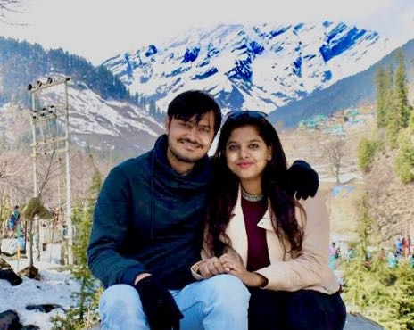

# About Me

* * *

## Professional Summary

Versatile Project Manager known for successfully executing diverse project tasks to accomplish pending deadlines. Enthusiastic problem solver and talented performer with superior communication, planning and decision making skills. Operates effectively in busy, deadline-oriented settings and work well with all stakeholders.

## Overview

| **Skill**        | **Strength**          |
|:-------------|:------------------|
| Agile Methodology   | Good |
| Project Management  | Good |
| Database Management  | Very good  |
| Scrum Master | Average |

* * *

## Work History

#### Project Analyst (Mar 2019 to date)

`Juego Studio (Bengaluru, Karnataka)`

* Transitioned projects from requirement gathering, estimation and pre-production phase to well-defined project execution plan and maintenance phase

* Worked on multiple projects from project start through delivery by prioritizing needs and delegating assignments
    1. **Unity game engine** - Coin kings
    2. **AR projects** - FLO wigs
    3. **VR projects** - 3D Organan, United Airlines - Jetbridge, American Airlines - Fuel Spillage
    4. **Cocos 2D game engine** - Snake Crazy Cannon
    
* Coordinated with business development teams and planned the entire project in milestones
* Coordinated presentations and in-depth reports for project members detailing project scope, progress and results, keeping all entities well-informed of milestones and goals
* Planned and arranged meetings with internal and external organizations, enabling all parties to meet and discuss project progress
* Liaised between project team and the client, facilitating communications and keeping appropriate parties updated on project developments
* Reduced project completion time at by 40%
* Traveled to off-site serving as clien's primary liaison with customers by providing detailed progress reports

* * *

#### Quality Assurance Tester II (till Feb 2019)

`Electronic Arts Games Private Limited (Hyderabad, Telangana)`

* As Quality Assurance Tester II, took the initiative ownership of an entire project alone from QA and updating the day to day status mail of scope testing to the Project Lead and Manager. The update has been delivered successfully on 3 platforms without a single issue raised after the submission
* Developing Test Cases for new features based on design documents provided in Confluence while being active in design discussions and play test sessions
* To work on Mobile game testing and Web based game testing which involves cross platform, cross browser testing along with other testing methodologies

Please explore me on [LinkedIn](https://www.linkedin.com/in/sravanthi-surekutchi-269b93112/)
